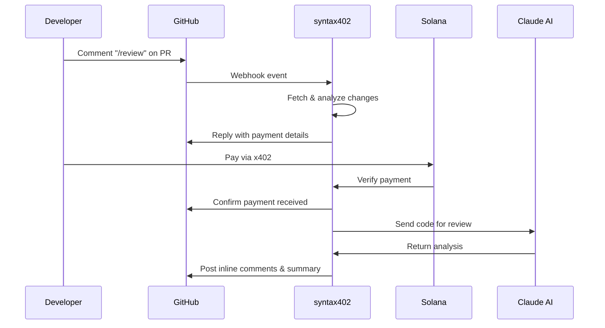

# syntax402

AI-powered code reviews using [x402](https://x402.org/). Pay per review, skip the subscription.

## The Problem

Quality code reviews are essential but expensive. Hiring experienced developers costs significant time and money. AI-powered review services typically require monthly subscriptions of $20-100, forcing you to pay for access whether you need one review or fifty.

For solo developers, startups, and occasional open-source contributors, this creates a dilemma: pay for unused capacity or skip reviews entirely. syntax402 solves this with true pay-per-use pricing - you pay only for the reviews you request.

## What is this?

syntax402 brings AI code reviews to your GitHub pull requests with a simple pay-as-you-go model. Comment `/review` on any PR, complete a quick payment, and receive detailed feedback with inline comments and actionable suggestions.

No monthly subscriptions. No unused credits. Just on-demand reviews when you need them.

## Features

- **AI-Powered Analysis** - Claude Sonnet 4.5 reviews your code for bugs, security issues, performance bottlenecks, and best practices
- **Pay-Per-Use** - No subscriptions. Pay only for the reviews you request, priced dynamically by code volume
- **Instant Payments** - x402 protocol enables sub-second payment verification on Solana blockchain
- **Context-Aware Reviews** - Add specific instructions like "focus on security", "skip rate-limiting, will be handled on the next PR" or "pwease use uwu stywe and add wots mowe cute emoticons, onii-chan~ >w< 💖✨"

## How it works

**The process:**

1. **Request** - Comment `/review` on your PR. Add context if needed: `/review focus on security vulnerabilities`
2. **Price** - Bot analyzes your changes and calculates cost based on the amount of code to review
3. **Pay** - Complete payment using USDC on Solana through the [x402 protocol](https://x402.org/)
4. **Review** - AI analyzes your code and posts inline comments directly on the changed lines
5. **Results** - Get detailed feedback covering bugs, security, performance, and code quality

## Why x402?

Traditional subscriptions mean paying for access you might not use. [x402](https://x402.org/) enables micropayments for individual requests - you pay only when you need a review.

Payments are peer-to-peer on the Solana blockchain using USDC. No intermediaries, no recurring charges, no commitment required.

## Built With

**Infrastructure**
- [Bun](https://bun.sh) - Fast JavaScript runtime and package manager
- [Hono](https://hono.dev) - Ultrafast web framework

**Integration**
- [Anthropic Claude](https://anthropic.com) - Sonnet 4.5 for code analysis
- [x402](https://x402.org) - An open protocol for internet-native payments
- [Solana](https://solana.com) - Blockchain for instant settlements
- [Octokit](https://github.com/octokit) - GitHub API integration

**Development**
- TypeScript - Type-safe codebase
- Biome - Fast linting and formatting

## What's Next

**Current Status**
- ✅ GitHub integration
- ✅ x402 payment protocol
- ✅ AI-powered code analysis
- ✅ Dynamic pricing based on PR size

**Upcoming Features**
- [ ] Multiple AI model support (OpenAI, Gemini, etc.)
- [ ] Enable auto-payment
- [ ] Custom review rules per repository (e.g., code quality, security, performance)

## Acknowledgments

- Powered by [Anthropic Claude](https://anthropic.com) AI
- Payment protocol by [x402.org](https://x402.org)
- Built with [Bun](https://bun.sh) and [Hono](https://hono.dev)
